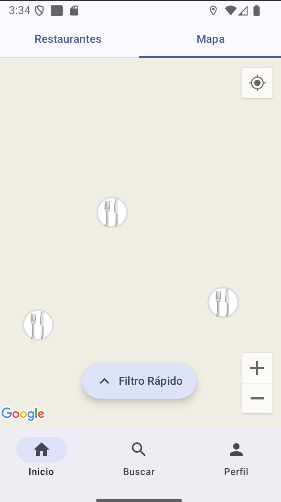
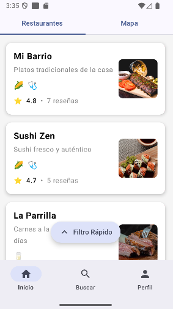
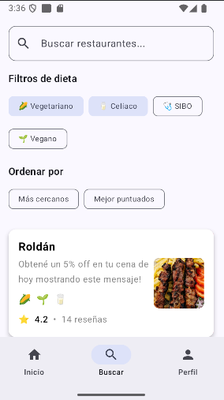
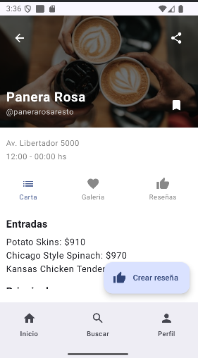
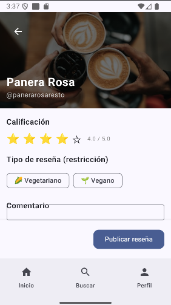
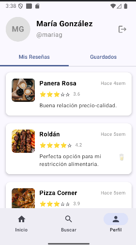
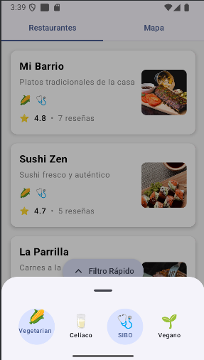

# FoodForAll 🍽️

**Descubre restaurantes que se adaptan a tus necesidades alimentarias**

FoodForAll es una aplicación Android diseñada para ayudarte a encontrar restaurantes que ofrecen opciones compatibles con tus restricciones dietéticas. Ya seas vegetariano, vegano, celíaco, o tengas cualquier otra necesidad alimentaria especial, FoodForAll te conecta con los lugares perfectos para disfrutar de una comida deliciosa y segura.

## 📱 Descripción 

Encuentra restaurantes adaptados a tus restricciones alimentarias

**FoodForAll - Tu guía de restaurantes inclusivos**

¿Buscas un restaurante que se adapte a tus necesidades alimentarias? FoodForAll es la solución perfecta. Nuestra aplicación te ayuda a descubrir restaurantes que ofrecen opciones para vegetarianos, veganos, celíacos y otras restricciones dietéticas.

**✨ Características principales:**

🗺️ **Mapa interactivo**
- Explora restaurantes cercanos en un mapa interactivo
- Visualiza la ubicación exacta de cada restaurante
- Filtra por distancia y tipo de restricción dietética

🔍 **Búsqueda inteligente**
- Busca restaurantes por nombre o descripción
- Filtra por múltiples restricciones dietéticas simultáneamente (ej: vegetariano Y celíaco)
- Ordena por distancia o mejor calificación

⭐ **Sistema de reseñas**
- Lee reseñas de otros usuarios con tus mismas necesidades
- Comparte tu experiencia con calificaciones y comentarios
- Filtra reseñas por tipo de restricción dietética

💾 **Guardar favoritos**
- Guarda tus restaurantes preferidos para acceso rápido
- Organiza tus lugares favoritos en un solo lugar

👤 **Perfil personalizado**
- Accede a todas tus reseñas en un solo lugar
- Gestiona tus restaurantes guardados
- Navega fácilmente a los restaurantes desde tus reseñas

🔔 **Notificaciones inteligentes**
- Recibe sugerencias cuando estés cerca de un restaurante compatible
- La app detecta automáticamente cuando permaneces en un lugar

🎨 **Interfaz moderna**
- Diseño intuitivo y fácil de usar
- Navegación fluida entre pantallas
- Búsqueda con debounce para mejor rendimiento

**🔐 Privacidad y seguridad:**
- Autenticación segura con Firebase
- Tus datos están protegidos
- Puedes usar la app como invitado o crear una cuenta

**🌍 Para todos:**
FoodForAll está diseñada para personas con diferentes necesidades alimentarias:
- Vegetarianos
- Veganos
- Celíacos
- Personas con alergias alimentarias
- Y cualquier otra restricción dietética

**📲 Descarga FoodForAll hoy y descubre una nueva forma de encontrar restaurantes que realmente se adapten a ti.**

---

## 📸 Capturas de Pantalla

### 1. Pantalla de Inicio (Mapa)
Vista del mapa con marcadores de restaurantes, filtros rápidos accesibles desde el botón flotante y bottom sheet con información del restaurante seleccionado.



### 2. Lista de Restaurantes
Tarjetas con información de cada restaurante, indicadores de restricciones dietéticas y acceso rápido para crear reseñas.



### 3. Búsqueda
Barra de búsqueda con debounce, filtros de dieta con selección múltiple y opciones de ordenamiento (distancia, calificación).



### 4. Perfil de Restaurante
Información detallada del restaurante, galería de imágenes, lista de reseñas con usuarios y opción para guardar restaurante.



### 5. Crear Reseña
Sistema de calificación con estrellas, selección de restricción dietética, campo de comentario y subida de imágenes.



### 6. Perfil de Usuario
Mis Reseñas: Lista de todas las reseñas del usuario. Guardados: Restaurantes favoritos guardados. Acceso rápido a restaurantes desde las reseñas.



### 7. Filtros Rápidos
Filtros accesibles desde la pantalla principal para filtrar restaurantes por restricciones dietéticas.



---

## 🚀 Requisitos

- Android Studio
- Node.js y npm
- Firebase CLI: `npm install -g firebase-tools`

## ⚙️ Setup

### 1. Instalar dependencias

```bash
npm install
```

### 2. Configurar archivos

#### Google Maps API Key

Crear `android/local.properties`:
```properties
sdk.dir=/path/to/Android/Sdk
MAPS_API_KEY=TU_API_KEY
```

#### Firebase

Usar los `.template` como referencia:
- `android/app/src/debug/google-services.json` (desarrollo con emuladores)
- `android/app/src/release/google-services.json` (producción)

### 3. Correr el proyecto

```bash
# Terminal 1: Iniciar emuladores Firebase (Firestore + Auth)
npm run emulators

# Terminal 2: Cargar datos de prueba
npm run seed

# Terminal 3: Instalar app
cd android && ./gradlew installDebug
```

**Emulador UI:** http://localhost:4000

## 📁 Estructura

```
FoodForAll/
├── android/          # App Android (Kotlin + Compose)
├── firebase/         # Configuración Firebase
│   ├── seed.js      # Script de datos
│   ├── firebase.json
│   └── firestore.rules
└── package.json
```

## 🔐 Autenticación

La app incluye un sistema de autenticación con Firebase Auth:

- **Login/Registro:** Email y contraseña
- **Modo guest:** Navegar sin autenticación
- **Protección de features:** Login requerido para crear reviews, guardar restaurantes y acceder al perfil
- **Logout:** Disponible en la pantalla de perfil

### Usuarios de prueba (creados por el seeder)

Todos los usuarios tienen la contraseña: `test123`

```
juan@example.com
maria@example.com
carlos@example.com
laura@example.com
pedro@example.com
```

## 🛠️ Comandos

```bash
# Firebase
npm run emulators    # Iniciar emuladores (Firestore:9000, Auth:9099, UI:4000)
npm run seed        # Cargar datos de prueba (usuarios, restaurantes, reviews)

# Android
cd android
./gradlew installDebug     # Debug (conecta a emuladores)
./gradlew installRelease   # Release (conecta a Firebase producción)
./gradlew clean           # Limpiar build
```

## 🐛 Troubleshooting

**Error: google-services.json missing**
```bash
cp android/app/src/debug/google-services.json.template android/app/src/debug/google-services.json
# Editar con tus credenciales
```

**Error: No se conecta al emulador**
- Verificar que esté corriendo: `npm run emulators`
- La app usa `10.0.2.2:9000` (Firestore) y `10.0.2.2:9099` (Auth) desde el emulador Android
- Verificar que el emulador UI muestre datos en http://localhost:4000

**Error: Datos no se cargan después de cambios**
```bash
# Limpiar datos de la app
adb shell pm clear ar.edu.utn.frba.mobile.foodforall
# Reinstalar
cd android && ./gradlew installDebug
```

**Error de autenticación (INVALID_REFRESH_TOKEN)**
```bash
# Limpiar cache de la app
adb shell pm clear ar.edu.utn.frba.mobile.foodforall
# O desde el dispositivo: Settings → Apps → FoodForAll → Storage → Clear Data
```

## 🏗️ Arquitectura

### Tecnologías utilizadas

- **Kotlin** - Lenguaje de programación
- **Jetpack Compose** - Framework de UI moderna
- **Material Design 3** - Sistema de diseño
- **Firebase Firestore** - Base de datos NoSQL en la nube
- **Firebase Authentication** - Autenticación de usuarios
- **Google Maps SDK** - Integración de mapas
- **Google Play Services Location** - Servicios de ubicación
- **Coil** - Carga asíncrona de imágenes
- **Coroutines & Flow** - Programación asíncrona y reactiva
- **MVVM** - Arquitectura Model-View-ViewModel

### APIs del Sistema Operativo

La aplicación utiliza las siguientes APIs del sistema operativo Android:

1. **Geolocation API**
   - Acceso a la ubicación del usuario en tiempo real
   - Servicio en primer plano para detección de estancias
   - Permisos de ubicación en primer y segundo plano

2. **Notifications API**
   - Notificaciones para sugerencias de restaurantes cercanos
   - Canal de notificaciones para el servicio de detección de estancias
   - Notificaciones persistentes para servicios en primer plano

### Comunicación con Servicio Remoto

La aplicación se comunica con Firebase (servicio remoto) para:

- **Almacenamiento de datos**: Restaurantes, usuarios, reseñas y restaurantes guardados
- **Autenticación**: Login y registro de usuarios
- **Sincronización en tiempo real**: Actualizaciones de datos desde Firestore
- **Consistencia de sesión**: Las respuestas del servidor son consistentes durante la sesión del usuario

## 📄 Licencia

Ver archivo [LICENSE](LICENSE) para más detalles.
